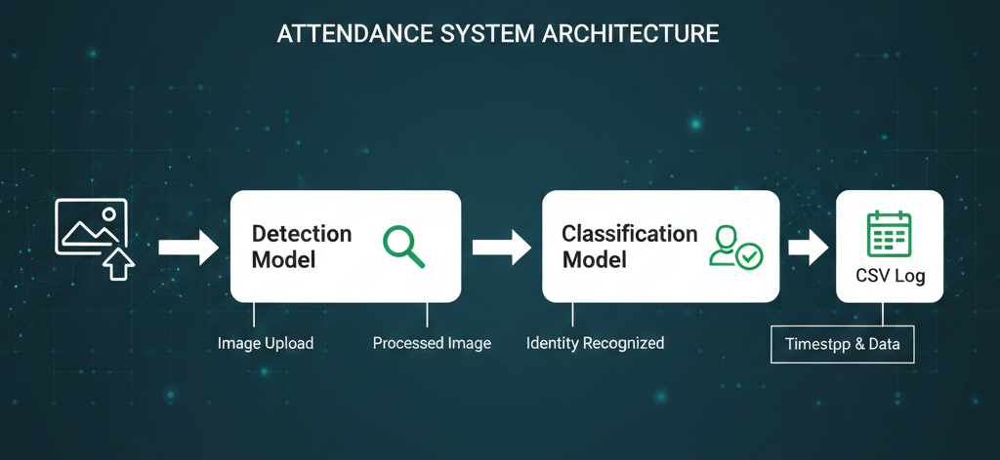
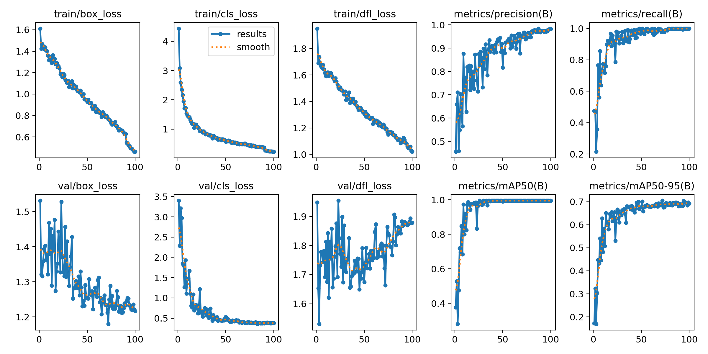
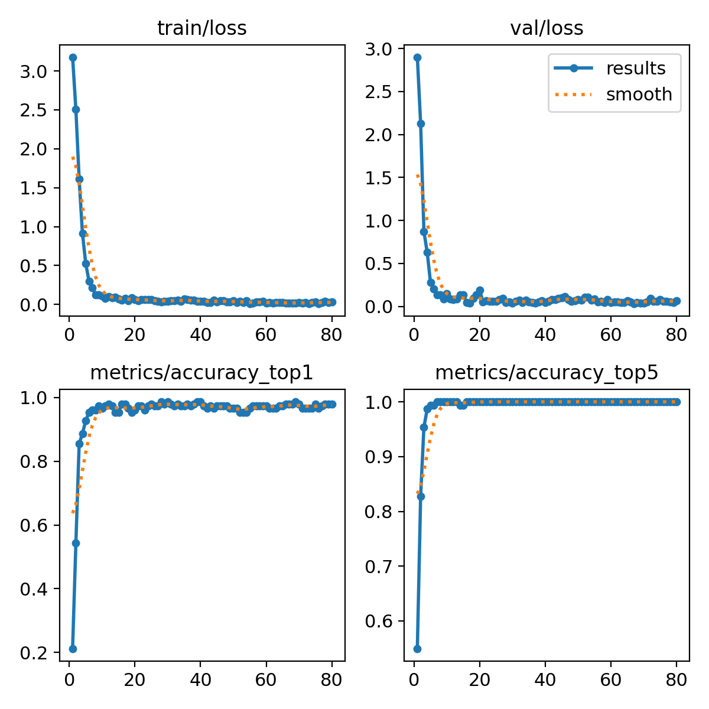

# Attendance System using YOLOv11

A Flask-based real-time attendance system that uses YOLOv11 for face detection and student identification.

## 📋 Table of Contents
- [Overview](#overview)
- [Features](#features)
- [Project Structure](#project-structure)
- [Installation](#installation)
- [Usage](#usage)
- [Model Performance](#model-performance)
- [Results](#results)

## 🎯 Overview

This project automates attendance tracking by detecting faces in images and classifying them as specific students using deep learning models. It provides a web interface for uploading images and automatically logs attendance with timestamps and confidence scores.



## ✨ Features

- **Real-time Face Detection** using YOLOv11 detection model
- **Student Classification** with 98.67% accuracy
- **Web Interface** for easy image uploads
- **Automatic Attendance Logging** with timestamps and confidence scores
- **CSV Export** for attendance records
- **Bounding Box Visualization** showing detected faces and student IDs

## 📁 Project Structure

```
attendance-system/
│
├── app.py                          # Flask application with detection/classification logic
├── requirements.txt                # Python dependencies
├── README.md                       # This file
│
├── models/
│   ├── best_de.pt                 # YOLOv11 Detection Model
│   └── best_class.pt              # YOLOv11 Classification Model
│
├── templates/
│   └── index.html                 # Web interface
│
├── static/
│   └── js/
│       └── script.js              # Frontend JavaScript logic
│
├── results/
│   └── predictions.csv            # Attendance records log
│
└── notebooks/
    └── Copy_of_Yolo_classification.ipynb  # Model training & evaluation
```

## 🚀 Installation

### Prerequisites
- Python 3.8+
- pip package manager
- Windows/Linux/macOS

### Steps

1. **Clone or extract the project**
   ```bash
   cd attendance-system
   ```

2. **Create a virtual environment** (recommended)
   ```bash
   python -m venv venv
   venv\Scripts\activate
   ```

3. **Install dependencies**
   ```bash
   pip install -r requirements.txt
   ```

4. **Ensure models are in place**
   - `models/best_de.pt` (Detection model)
   - `models/best_class.pt` (Classification model)

## 💻 Usage

### Running the Application

1. **Start the Flask server**
   ```bash
   python app.py
   ```

2. **Open your browser**
   ```
   http://localhost:5000
   ```

3. **Upload an image**
   - Click the upload form on the web interface
   - Select an image containing student faces
   - View results with student IDs, confidence scores, and timestamps

4. **Check attendance logs**
   - Open `results/predictions.csv` to view all recorded attendances


## 📊 Model Performance

### Detection Model (best_de.pt)
- **Architecture**: YOLOv11 Detection
- **Purpose**: Locates faces in images
- **Output**: Bounding box coordinates


### Classification Model (best_class.pt)
- **Architecture**: YOLOv11 Classification
- **Accuracy**: **98.67% Top-1**
- **Classes**: 28 Student IDs (2022002, 2022074, 2022075, ... etc.)
- **Inference Time**: ~9ms per image



## 📈 Results

All attendance predictions are automatically logged in `results/predictions.csv` with:
- Student ID / Class Label
- Confidence Score
- Bounding Box Coordinates
- Timestamp

### Example Output
```csv
label,confidence,x1,y1,x2,y2,timestamp
2022002,0.98,145,230,320,450,2026-02-03 14:35:22
2022074,0.95,450,180,620,410,2026-02-03 14:35:23
```


## 🛠️ Technologies Used

- **Framework**: Flask
- **Deep Learning**: YOLOv11 (Ultralytics)
- **Computer Vision**: OpenCV
- **Frontend**: HTML, JavaScript
- **Data Storage**: CSV
- **Language**: Python 3.8+

## 📝 Training Details

The classification model was trained on student face images with data augmentation and achieved 98.67% accuracy. See `Copy_of_Yolo_classification.ipynb` for full training details.

## 🤝 Contributing

Feel free to improve this project by:
- Adding more students to the classification model
- Enhancing the web interface UI
- Implementing database storage instead of CSV
- Adding real-time camera support

## 📄 License

This project is for educational purposes at GIKI University (DNN AI341 Course).

## 👨‍💻 Authors

Maqsood and Karrar
GIKI 5th Semester - DNN AI341 Project

---

**Last Updated**: February 3, 2026
